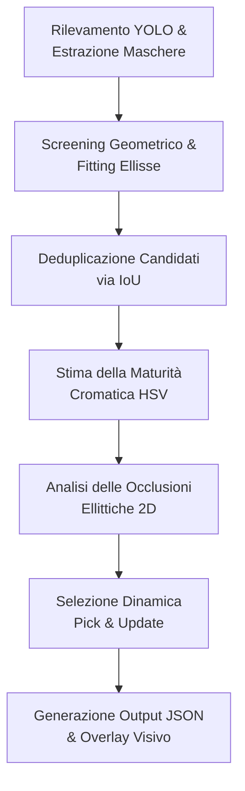

# Analisi Metodologica dell'Algoritmo di Task Planning per la Raccolta Robotizzata

Questa relazione fornisce un'analisi tecnica e critica dell'algoritmo di pianificazione delle attività (*Task Planning*) implementato in [reachability_ranking_circular.py](.reachability_ranking_circular.py). L'analisi descrive dettagliatamente ciascuna fase del processo decisionale (*pipeline*) ed evidenzia i limiti metodologici e ingegneristici del sistema in relazione a uno scenario di robotica industriale/agricola.

---

## 1. Architettura della Pipeline Decisionale

L'algoritmo implementa un sistema euristico per determinare l'ordine ottimale di raccolta (*picking sequence*) dei frutti (pomodori) individuati nell'immagine. Il flusso elaborativo si articola in cinque fasi sequenziali principali:

---

## 2. Analisi Dettagliata dei Singoli Passaggi

### Fase 1: Rilevamento e Screening Geometrico Iniziale
L'algoritmo carica un modello di object detection e segmentation (YOLO) e processa ciascuna immagine nella cartella specificata. 

1. **Inferenza YOLO**:
   * Esegue la predizione sull'immagine di input ridimensionata a $800 \times 800$ pixel (parametro `IMGSZ`).
   * Estrae le maschere di segmentazione associate alla classe target (specificata da `TARGET_CLASS = 3`, tipicamente corrispondente a pomodoro) che superano la soglia di confidenza `CONF = 0.3`.
   * Le maschere binarie ottenute vengono riscalate alla risoluzione originale dell'immagine tramite interpolazione bilineare (`cv2.resize`) e binarizzate con soglia $0.5$.

2. **Calcolo dello Score Geometrico (`compute_geometric_score`)**:
   Per ciascuna maschera binaria valida, viene calcolato un punteggio di raggiungibilità geometrica basato su tre parametri:
   * **Area del Frutto**: Calcolata come somma dei pixel attivi ($Area = \sum P_{xy}$). Se $Area < AREA\_MIN$ ($1500\text{ px}$), la maschera viene scartata per escludere falsi positivi o frutti eccessivamente distanti/piccoli.
   * **Convex Hull (Involucro Convesso)**: Viene determinato l'involucro convesso dei punti della maschera tramite `cv2.convexHull`. Questo passaggio serve a "riempire" artificialmente eventuali vuoti o rientranze indotte da occlusioni parziali (es. piccoli rami o foglie).
   * **Fitting dell'Ellisse**: Sull'involucro convesso viene fittata un'ellisse bidimensionale tramite l'algoritmo dei minimi quadrati di Fitzgibbon (`cv2.fitEllipse`). L'ellisse risultante è definita da centro, assi ed angolo di rotazione: $((x,y), (w,h), \theta)$.
   * **Circolarità (Circularity)**: Calcolata sull'involucro convesso come:
     $$\text{Circularity} = \min\left(1.0, \frac{4 \pi \cdot \text{Area}}{\text{Perimetro}^2}\right)$$
   * **Centralità (Centrality)**: Misura la prossimità del centroide del frutto $(c_x, c_y)$ rispetto al centro geometrico dell'immagine $(W/2, H/2)$. È calcolata come:
     $$\text{Centrality} = 1.0 - \frac{\sqrt{(c_x - W/2)^2 + (c_y - H/2)^2}}{\text{Distanza Massima}}$$
     dove la Distanza Massima è la semi-diagonale dell'inquadratura.
   * **Area Normalizzata (Normalized Area)**:
     $$\text{Area Norm} = \min\left(1.0, \frac{\text{Area}}{0.15 \cdot W \cdot H}\right)$$
   * **Punteggio Geometrico Complessivo ($S_{geo}$)**:
     $$S_{geo} = W_{area} \cdot \text{Area Norm} + W_{circularity} \cdot \text{Circularity} + W_{centrality} \cdot \text{Centrality}$$
     I pesi predefiniti sono rispettivamente $W_{area} = 0.45$, $W_{circularity} = 0.35$ e $W_{centrality} = 0.20$.

---

### Fase 2: Deduplicazione dei Candidati
Prima di procedere alla stima della maturità, le maschere candidate vengono ordinate per confidenza YOLO decrescente.
* Viene eseguito un confronto pairwise calcolando l'Intersection over Union (IoU) tra le maschere binarie.
* Se l'IoU tra un candidato e un altro già validato supera la soglia `DEDUPLICATION_THRESHOLD = 0.70`, il candidato corrente viene classificato come duplicato e rimosso.
* I candidati rimanenti vengono riordinati in base al punteggio geometrico $S_{geo}$ decrescente e ne viene estratto un sottoinsieme prioritario limitato a `GEOMETRIC_POOL = 8` elementi.

---

### Fase 3: Filtro di Maturità Cromatica (`compute_maturity`)
La maturità di ciascuno degli 8 candidati selezionati viene calcolata analizzando la distribuzione del colore nello spazio HSV:
1. Conversione dell'immagine originale da BGR a HSV.
2. Definizione dei range cromatici:
   * **Rosso (Red)**: Diviso in due intervalli per gestire la ciclicità del canale Hue: $[0, 15]$ e $[165, 180]$ (con saturazione e valore minimi a 50).
   * **Verde (Green)**: Intervallo $[35, 85]$ (saturazione e valore minimi a 40).
3. **Calcolo dell'Indice di Maturità**:
   Vengono contati i pixel interni alla maschera di segmentazione del frutto che rientrano nelle maschere del rosso ($N_{red}$) e del verde ($N_{green}$).
   $$\text{Maturity} = \frac{N_{red}}{N_{red} + N_{green}}$$
   Se $N_{red} + N_{green} = 0$, viene assegnato un valore pari a $0.0$ per adottare un approccio conservativo (*safe-fail*) ed evitare che falsi positivi o oggetti cromaticamente non classificabili vengano considerati pronti per il picking.
   Solo i frutti con $\text{Maturity} \ge MATURITY\_THRESHOLD = 0.5$ sono considerati idonei per la raccolta attiva.

---

### Fase 4: Analisi delle Occlusioni Ellittiche (`check_occlusion_ellipse`)
L'algoritmo stima le relazioni di occlusione tra i frutti fittando le ellisioni nello spazio 2D dell'immagine:
* Per ogni coppia di candidati $A$ e $B$ nel pool, si verifica se $A$ occlude $B$ proiettando le rispettive ellissi su due maschere binarie dedicate.
* Si calcola l'area di intersezione tra le due ellissi piene.
* Si definisce che il candidato $A$ occlude $B$ se:
  1. Il rapporto di sovrapposizione supera la soglia di tolleranza (`IOU_THRESHOLD = 0.15`):
     $$\frac{\text{Area}(A_{ellipse} \cap B_{ellipse})}{\text{Area}(B_{ellipse})} > 0.15$$
  2. L'area della maschera segmentata reale di $B$ è inferiore a quella di $A$ ($\text{Area}_B < \text{Area}_A$). Questa euristica assume che il frutto occluso presenti una superficie visibile minore rispetto all'occludente.
* Se le condizioni sono soddisfatte, $B$ viene aggiunto alla lista degli elementi occlusi da $A$ (`a["occluded_by_me"]`).

---

### Fase 5: Selezione Dinamica "Pick & Update"
Viene avviato un loop iterativo per selezionare al massimo `MAX_TARGETS = 3` frutti da raccogliere, simulando l'effetto dinamico della rimozione fisica di un frutto sulla scena:

1. **Valutazione dello Stato di Occlusione**:
   Ad ogni iterazione, per ciascun candidato non ancora selezionato e con maturità sufficiente, si verifica se è attualmente occluso da un altro elemento del pool non ancora rimosso/raccolto.
   * Se occluso, viene applicata una penalità moltiplicativa al punteggio geometrico (`PENALTY_OCCLUDED = 0.7`).
   * Altrimenti, il fattore di penalità è $1.0$.

2. **Calcolo dello Score di Selezione Finale ($S_{final}$)**:
   $$S_{final} = S_{geo} \cdot \text{Penalità} \cdot \text{Bonus}$$
   *(Inizialmente il parametro `Bonus` è impostato a $1.0$)*.

3. **Scelta del Target Ottimo**:
   I candidati vengono ordinati per $S_{final}$ decrescente. Il candidato con il punteggio massimo viene rimosso dal pool, contrassegnato come selezionato (`is_selected = True`) ed aggiunto alla lista di raccolta `selected`.

4. **Aggiornamento Dinamico (Update)**:
   Per ciascun elemento $U$ che era occluso dal frutto appena rimosso (cioè presente nella lista `best["occluded_by_me"]`):
   * Viene rimosso il vincolo di occlusione causato da questo specifico frutto (quindi non subirà più la penalità nelle iterazioni successive).
   * Viene applicato un moltiplicatore di incentivo (`BONUS_UNLOCKED = 1.2`) per simulare il fatto che la rimozione del frutto superiore rende il sottostante libero e facilmente accessibile.
   * Si traccia l'ordine di sblocco associando l'indice del pick corrente (`unlocked_by`).

---

## 3. Ottimizzazioni Prestazionali e Sviluppi Futuri

L'attuale implementazione della stima delle occlusioni in [check_occlusion_ellipse](./reachability_ranking_circular.py#L102-L128) presenta limiti sia prestazionali (legati al calcolo su immagine intera) sia metodologici (legati alla determinazione qualitativa dell'ordine di profondità). Di seguito vengono analizzate le criticità e proposte le rispettive soluzioni:

### 3.1 Ottimizzazione Prestazionale: Approccio Ibrido Gating/ROI
*   **Il problema (Rasterizzazione su Immagine Intera)**: Per ogni confronto pairwise nel pool ($O(N^2)$ coppie), l'algoritmo alloca in memoria due matrici vuote della risoluzione originale dell'immagine ($W \times H$), vi disegna sopra le ellissi piene con `cv2.ellipse` ed esegue un'operazione logica `cv2.bitwise_and`. Questo calcolo pixel-by-pixel eseguito $N(N-1)$ volte per frame satura inutilmente le risorse della CPU.
*   **La Soluzione di Ottimizzazione Proposta (Approccio Ibrido)**:
    1.  **Gating Algebrico preliminare ($O(1)$)**: Si approssimano le due ellissi con i loro cerchi circoscritti, aventi raggio pari al semiasse maggiore $R_{max} = \max(w, h)/2$. Se la distanza euclidea $d$ tra i due centroidi è maggiore della somma dei rispettivi raggi massimi ($d > R_{max, A} + R_{max, B}$), non vi è alcuna sovrapposizione geometrica possibile. La coppia viene scartata istantaneamente a livello algebrico, risparmiando oltre il 90% delle allocazioni e operazioni di disegno.
    2.  **Rasterizzazione locale su ROI**: Per le sole coppie che superano il gating iniziale, si esegue la rasterizzazione limitando la creazione delle maschere binarie e l'operazione bitwise a una Region of Interest (ROI) locale, ritagliata attorno all'unione delle bounding box dei due frutti (es. matrici di $200 \times 200$ pixel anziché $1920 \times 1080$), riducendo l'area di computazione di oltre il 95%.

### 3.2 Miglioramento della Precisione Fisica: Euristica di Pixel Ownership
*   **Il problema (Determinazione Naive dell'Ordine di Profondità)**: Attualmente, l'ordine di profondità (chi occlude chi) viene determinato confrontando le aree totali delle maschere visibili (`occluded["area"] < blocker["area"]`). Questa euristica fallisce in due scenari reali:
    1.  *Frutti di dimensioni diverse*: Un frutto di grandi dimensioni posto in secondo piano (occluso) può presentare una superficie visibile residua maggiore rispetto all'area totale di un frutto piccolo posto in primo piano (occludente).
    2.  *Occlusioni asimmetriche esterne*: Elementi terzi (foglie, rami) che coprono parzialmente il frutto in primo piano ne riducono l'area visibile complessiva, invertendo erroneamente la relazione stimata.
*   **La Soluzione Proposta (Pixel Ownership)**:
    Siano $E_A$ ed $E_B$ le ellissi piene fittate per due frutti in sovrapposizione, e siano $M_A$ e $M_B$ le rispettive maschere binarie reali di segmentazione (pixel visibili) fornite da YOLO. Si calcola la regione di intersezione delle due ellissi $I = E_A \cap E_B$. 
    Essendo i frutti corpi opachi, nello spazio d'intersezione proiettato la telecamera rileva esclusivamente la superficie del frutto situato in primo piano. Pertanto, l'ordine di profondità può essere calcolato confrontando il numero di pixel reali appartenenti a ciascun frutto all'interno della zona di sovrapposizione:
    $$\Omega_A = \sum_{(x,y) \in I} M_A(x,y), \quad \Omega_B = \sum_{(x,y) \in I} M_B(x,y)$$
    Se $\Omega_A > \Omega_B$, allora il frutto $A$ è in primo piano (blocker) e il frutto $B$ è in secondo piano (occluso).
*   **Gestione dei Casi Limite (Edge Cases)**:
    1.  *Occlusione da elementi terzi*: Se la regione $I$ è interamente coperta da un ramo o foglia estranea, si otterrà $\Omega_A \approx 0$ e $\Omega_B \approx 0$. In questo scenario di stallo informativo si adatta un fallback che ripristina la comparazione delle aree complessive o dei centroidi.
    2.  *Incertezza sui confini*: Per prevenire decisioni errate causate da rumore di segmentazione ai bordi, si applica un margine di confidenza $\epsilon$, richiedendo una maggioranza netta ($\Omega_A > \Omega_B + \epsilon$) per convalidare la relazione di occlusione.

*Nota: L'ispirazione per l'ottimizzazione del depth ordering basato sulla geometria delle sovrapposizioni e sulla distanza euclidea tra i centroidi deriva dal lavoro pionieristico di Chen e Yang [1] (disponibile localmente in [s11554-011-0222-9.pdf](./tmp_paper_analysis/s11554-011-0222-9.pdf)), che affronta la stima delle occlusioni e l'ordinamento spaziale delle priorità di raccolta attraverso modelli geometrici a basso costo computazionale.*

---

